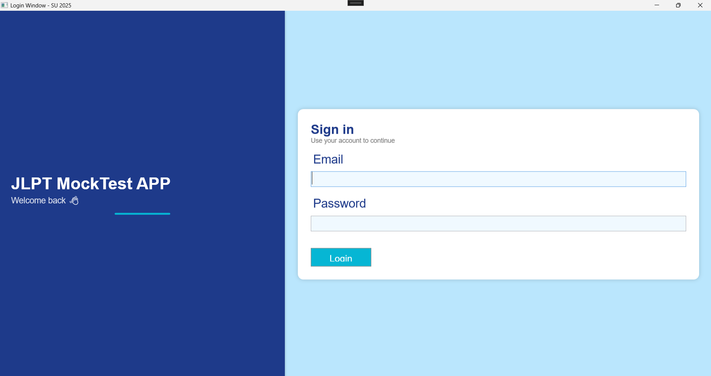
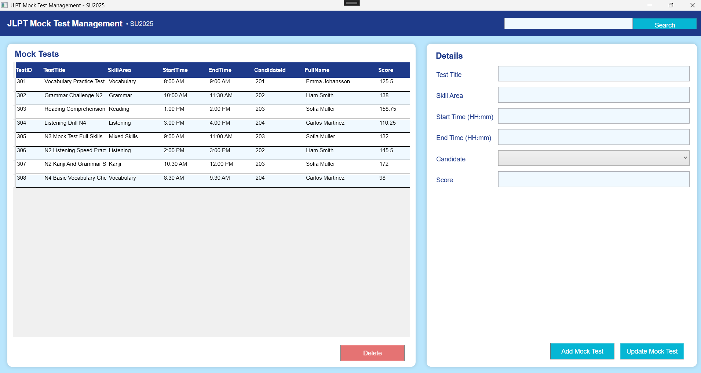

<p align="center">
  
</p>

## [Assignment](docs/PE_PRN212_SU25_JLPT.jpeg)
This repository contains the practice implementation for the PE PRN212 SU25 hands-on exam.  
The solution focuses on building a Windows Presentation Foundation (WPF) desktop application backed by SQL Server, following the layered architecture provided in the starter kit.

## Exam Instructions

- Do not use external materials or share data via any device while working on the exercise.
- Use Visual Studio 2019 (or later) together with SQL Server 2016 (or later) as your development environment.
- Syntax or compilation errors at submission time result in an automatic score of 0.
- Any code that is unrelated to the assessment brief invalidates the submission (score 0).
## Login Window (Example)
<p align="center">
  
</p>

## Main Window (Example)

<p align="center">
  
</p>


**Before implementing your solution, complete these steps:**

1. Build the application with Windows Presentation Foundation (WPF) using a three-layer architecture. Maintain at least two projects (presentation plus supporting class library). All database access must flow through the Data Access Layer and read the connection string from `appsettings.json`; hard-coded connection strings or direct database calls from WPF windows will receive 0 points.
2. Create the Visual Studio solution named `PE_PRN212_SU25_StudentName`. The WPF project should follow the convention `JLPTMockTestManagement_StudentCode`. (This practice repo uses `PE_PRN212_SU25_PHAM HONG PHUC` and `JLPTMOCKTESTMANGEMENT_QE190133` respectively.)
3. Provision the SQL Server database `SU25JLPTMockTestDB` by executing the script `SU25JLPTMockTestDB.sql` located at the repository root.
4. Set the login window/page as the startup UI for the WPF project.
5. Resolve every compiler warning and error before submission.
6. Keep the project focused on the required features; do not introduce unrelated functionality or data.

## Project Information

### Tech Stack
#### 💻 Desktop UI <br>


WPF on **.NET 9 (net9.0-windows)** with XAML styling and resource dictionaries.  
DataGrid binding, templated forms, and dialog-driven interactions.

---

#### 🧠 Business & Data Layers <br>


- **Business Logic Layer (BLL)** exposing high-level services (account, candidate, mock test).  
- **Data Access Layer (DAL)** built on Entity Framework Core 9 with repository abstractions.  
- Configuration-driven connection string resolution via `appsettings.json`.

---

#### 🗄️ Database & Cache <br>


- **SQL Server 2022** (or compatible) relational database.  
- Core tables: `JLPTAccount`, `Candidate`, and `MockTest` with cascade relationships.  
- Seed data aligned with the PE brief for authentication and mock test scenarios.

---

#### 🧰 Development Tooling <br>


- **Visual Studio 2022 (17.10+)** with WPF workload or the .NET 9 SDK.  
- **EF Core command-line tooling** for migrations and schema inspection.  
- **Git** for source control and versioned submissions.

## Repository Overview

- `BLL/` - Business services orchestrating account authentication, candidate retrieval, and CRUD for mock tests.
- `DAL/` - Entity Framework Core DbContext, entity definitions, and repositories.
- `PE_PRN212_SU25_PHAM HONG PHUC/` - WPF presentation layer with login and management windows.
- `PE_PRN212_SU25_PHAM HONG PHUC.sln` - Solution aggregating the layers for Visual Studio.
- `docs/` - Project banner and the detailed practice brief for quick reference.

## Practice Highlights

- **Exam-ready login workflow:** Implements the SU25 authentication requirement with role-aware permissions and friendly messaging.
- **Mock test management UI:** Modernized dashboard with search box, sortable grid, and detailed edit panel.
- **Role-based authorisation:** Admins (role 1) can manage the full lifecycle; managers (role 2) create/update; instructors (role 3) enjoy read-only access; guests (role 4) are denied.
- **Input validation & feedback:** Enforces business rules for time ranges, score formats, and title conventions as per the marking rubric.
- **Layered code organisation:** Separation between presentation, business logic, and data access to mirror the course architecture guidelines.

## Architecture Overview

- `Presentation (WPF)` renders login and main management windows, raises events, and handles user feedback.
- `BLL` coordinates repositories, encapsulates permission checks, and exposes reusable operations to the UI.
- `DAL` maps entities to SQL Server tables and centralises CRUD operations through EF Core repositories.
- `SQL Server` stores accounts, candidates, and mock test schedules with referential integrity.

**Runtime flow**

1. A user signs in through `LoginWindow`, which validates credentials with `JLPTAccountService`.
2. On success, `MainWindow` loads mock tests and candidate pick lists through the corresponding services.
3. User actions (search, add, update, delete) call business services that apply validation and role checks.
4. Repositories persist changes via EF Core; the UI refreshes its bindings to reflect the source-of-truth database.
5. Feedback is surfaced through message boxes so students can verify behaviour quickly during the exam.

## Assessment Tasks

| Question | Requirement (abridged) | Points* |
| --- | --- | --- |
| Q1 | Build the login window that authenticates against `JLPTAccount`, rejects guests (role 4), and opens the dashboard on success. | 0.5 |
| Q2 | Display the list of mock tests with candidate information in a DataGrid and preload supporting lists. | 1.5 |
| Q3 | Provide search/filter capability for mock tests by title (case-insensitive) and bind the result to the grid. | 1.5 |
| Q4 | Implement the Add form with validation (title pattern, time range, score, candidate selection) and persistence. | 2.0 |
| Q5 | Allow updates to the selected mock test with the same validation rules and refresh the grid. | 1.5 |
| Q6 | Enable delete with confirmation for administrators only, blocking other roles with clear messaging. | 1.0 |

\*Point allocation mirrors the practice brief; adjust if your instructor provides a different rubric.

## Getting Started

### Prerequisites

- Windows 10/11 with Visual Studio 2022 (or newer) and the .NET desktop development workload.
- .NET 9 SDK (`winget install Microsoft.DotNet.SDK.9` if needed).
- SQL Server 2022 (Developer or Express) with a login that has rights to create databases.

### Database Setup

1. Launch SQL Server Management Studio (or Azure Data Studio) using an account with database creation rights.
2. Open the script `SU25JLPTMockTestDB.sql` located at `C:\Users\patmy\OneDrive\Documents\PRN212\PE_PRN212_SU25_PHAMHONGPHUC_GIT\SU25JLPTMockTestDB.sql`.
3. Execute the script to create `SU25JLPTMockTestDB`, tables, relationships, seed data, and sample accounts.
4. Verify that the tables `JLPTAccount`, `Candidate`, and `MockTest` contain the seeded records required for the practice exercise.

> The default connection string lives in `PE_PRN212_SU25_PHAM HONG PHUC/appsettings.json`.  
> Replace `Server=DESKTOP-V9LJUO9\SQLEXPRESS;uid=sa;pwd=1234567890;` with your own SQL Server instance and credentials.

### Connection String & EF Core Reference

```json
{
  "ConnectionStrings": {
    "DefaultConnection": "server=(local);database=SU25JLPTMockTestDB;uid=sa;pwd=1234567890;TrustServerCertificate=True;"
  }
}
```

- Keep the connection string in `appsettings.json` within the WPF project and set **Copy to Output Directory** to **Copy always**.
- Install the following NuGet packages (version 9.0.6 for .NET 9 projects):
  - `Microsoft.EntityFrameworkCore.SqlServer`
  - `Microsoft.EntityFrameworkCore.Design`
  - `Microsoft.EntityFrameworkCore.Tools`
  - `Microsoft.Extensions.Configuration`
  - `Microsoft.Extensions.Configuration.Json`
- Package Manager Console commands:
  ```
  Install-Package Microsoft.EntityFrameworkCore.SqlServer -Version 9.0.6
  Install-Package Microsoft.EntityFrameworkCore.Design -Version 9.0.6
  Install-Package Microsoft.EntityFrameworkCore.Tools -Version 9.0.6
  Install-Package Microsoft.Extensions.Configuration -Version 9.0.6
  Install-Package Microsoft.Extensions.Configuration.Json -Version 9.0.6
  ```
- CLI equivalents:
  ```
  dotnet add package Microsoft.EntityFrameworkCore.SqlServer --version 9.0.6
  dotnet add package Microsoft.EntityFrameworkCore.Design --version 9.0.6
  dotnet add package Microsoft.EntityFrameworkCore.Tools --version 9.0.6
  dotnet add package Microsoft.Extensions.Configuration --version 9.0.6
  dotnet add package Microsoft.Extensions.Configuration.Json --version 9.0.6
  ```
- Read the configuration from code using `ConfigurationBuilder` and inject it into EF Core:

  ```csharp
  private string GetConnectionString()
  {
      IConfiguration config = new ConfigurationBuilder()
          .SetBasePath(AppContext.BaseDirectory)
          .AddJsonFile("appsettings.json", optional: false, reloadOnChange: true)
          .Build();

      return config["ConnectionStrings:DefaultConnection"] ?? string.Empty;
  }

  protected override void OnConfiguring(DbContextOptionsBuilder optionsBuilder)
  {
      optionsBuilder.UseSqlServer(GetConnectionString());
  }
  ```
- Useful EF Core tooling commands:
  ```
  dotnet tool install --global dotnet-ef --version 9.0.6
  dotnet ef dbcontext scaffold "Server=(local);uid=sa;pwd=1234567890;database=SU25JLPTMockTestDB;TrustServerCertificate=True;" Microsoft.EntityFrameworkCore.SqlServer --output-dir ./Entities/
  dotnet ef migrations add InitialDB
  dotnet ef database update
  ```

### Run the Application

1. Open `PE_PRN212_SU25_PHAM HONG PHUC.sln` in Visual Studio.
2. Restore packages (`Build > Restore NuGet Packages`) or run `dotnet restore` from the solution root.
3. Ensure the WPF project `PE_PRN212_SU25_PHAM HONG PHUC` is the startup project.
4. Press `F5` (or run `dotnet build` then `dotnet run --project PE_PRN212_SU25_PHAM HONG PHUC`) to launch the login window.
5. Sign in with one of the seeded accounts (e.g. `admin@jlpt.com / Admin!234`) to explore full functionality.

## Validation Rules & Role Matrix

- **Title**: 5-150 characters, alphanumeric words separated by spaces, no `$ % ^ @`.
- **Time**: Start and end must be valid `HH:mm` values; end must be later than start.
- **Score**: Numeric, non-negative; decimals permitted.
- **Candidate**: Mandatory selection from the populated combo box.

| Role | Permissions |
| --- | --- |
| 1 - Administrator | Search, create, update, delete mock tests. |
| 2 - Manager | Search, create, update. Delete is disabled. |
| 3 - Instructor | Search and view only. |
| 4 - Guest | Blocked at login with an explanatory message. |

## Exam Conditions & Tips

- Work exclusively inside the provided virtual lab environment; do not install alternate SQL Servers or IDEs.
- Do not manipulate databases outside of the supplied scripts or EF context (no ad-hoc SSMS tooling during grading).
- Retain the solution structure (DAL + BLL + WPF) and avoid renaming projects unless instructed.
- Test each requirement after implementation: login, search, CRUD actions, and role-specific restrictions.
- Before submission, rebuild the solution to ensure no compilation warnings or missing dependencies remain.

## Acknowledgements

This practice artefact was prepared to mirror the SU25 PE guidelines so you can rehearse the workflow end-to-end before the official assessment. Adapt the connection string, sample data, and styling as needed for your environment while keeping the business rules intact.
